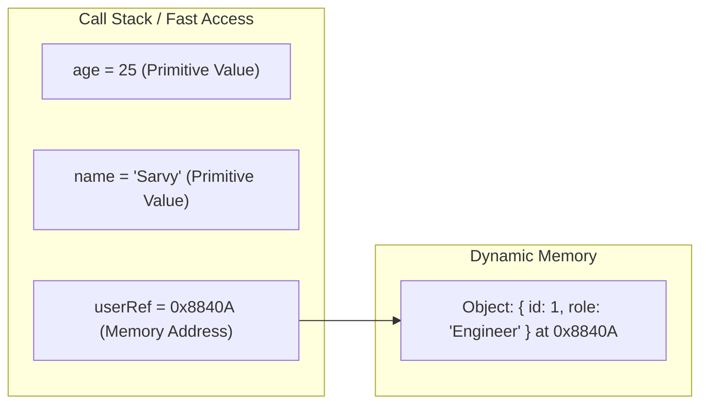

# 1.1 Variables, Scope & Data Types

[← Back to Chapter 1: JavaScript Fundamentals](./index.md)

Understanding how JavaScript stores data, manages variable lifecycles, and evaluates types is the first critical pillar for mastering React and debugging complex state management.

---

## 1. Variable Declarations: `var` vs `let` vs `const`

JavaScript provides three keywords for declaring variables, each with distinct scoping rules, hoisting behaviors, and re-assignment semantics.

| Feature | `var` | `let` | `const` |
| :--- | :--- | :--- | :--- |
| **Scope** | Function Scope | Block Scope (`{}`) | Block Scope (`{}`) |
| **Hoisting** | Hoisted with `undefined` | Hoisted (in TDZ) | Hoisted (in TDZ) |
| **Re-declaration** | Allowed in same scope | SyntaxError | SyntaxError |
| **Re-assignment** | Allowed | Allowed | TypeError |
| **Global Object Property** | Yes (`window.x`) | No | No |

```javascript
// Function Scope vs Block Scope
function scopeExample() {
  if (true) {
    var functionScoped = "Accessible throughout the function";
    let blockScoped = "Only accessible inside this if-block";
    const constantBlock = "Fixed reference inside this block";
  }

  console.log(functionScoped); // OK
  // console.log(blockScoped);  // ReferenceError: blockScoped is not defined
  // console.log(constantBlock); // ReferenceError: constantBlock is not defined
}
```

:::tip Best Practice
Prefer `const` by default for immutability and predictability. Use `let` only when you explicitly intend to reassign a variable (e.g., counters, accumulator variables). Completely avoid `var` in modern JavaScript.
:::

---

## 2. Scope in JavaScript: Global, Function, & Block

**Scope** defines the current context of execution in which values and expressions are "visible" or can be referenced. JavaScript has three primary types of scope:

### A. Global Scope
Variables declared outside of any function or curly braces `{}` are in the global scope. They can be accessed and modified from anywhere in the entire program.
```javascript
const appName = "CodeWithSarvy"; // Global variable

function displayApp() {
  console.log(appName); // Accessible here
}
```

### B. Function Scope (Local Scope)
Variables declared inside a function with `var`, `let`, or `const` are only accessible inside that function.
```javascript
function initSession() {
  var token = "xyz-123";
  let userId = 42;
}

// console.log(token);  // ReferenceError: token is not defined
// console.log(userId); // ReferenceError: userId is not defined
```

### C. Block Scope (`let` and `const`)
Introduced in ES6, any pair of curly braces `{}` (such as in `if` statements, `for` loops, or `while` blocks) creates a block scope for `let` and `const`. Variables declared with `var` **ignore** block boundaries!
```javascript
for (let i = 0; i < 3; i++) {
  // i is confined to this loop block
}
// console.log(i); // ReferenceError: i is not defined

for (var j = 0; j < 3; j++) {
  // j leaks out to the enclosing function or global scope!
}
console.log(j); // 3 (Leaked out!)
```

### D. The Scope Chain
When JavaScript tries to resolve a variable identifier, it first inspects the **local scope**. If not found, it steps outward to the **parent scope**, continuing up the hierarchy until reaching the **global scope**. If still not found, it throws a `ReferenceError`.

```javascript
const globalVar = "Global";

function outer() {
  const outerVar = "Outer";

  function inner() {
    const innerVar = "Inner";
    // Traverses up: innerVar (local) -> outerVar (parent) -> globalVar (global)
    console.log(`${innerVar} -> ${outerVar} -> ${globalVar}`);
  }

  inner();
}
outer();
```

---

## 3. Hoisting & The Temporal Dead Zone (TDZ)

**Hoisting** is the JavaScript engine's behavior of allocating memory for variable and function declarations during the **Creation Phase**, before any code executes.

- **`var` Hoisting**: The identifier is hoisted and initialized to `undefined`.
- **`let` & `const` Hoisting**: The identifier is hoisted into the scope's lexical environment, but **not initialized**. Accessing it before its declaration line triggers a `ReferenceError`. This unreachable zone is called the **Temporal Dead Zone (TDZ)**.

```javascript
console.log(hoistedVar); // logs: undefined
var hoistedVar = 42;

// Temporal Dead Zone Example
console.log(tdzVar); // ReferenceError: Cannot access 'tdzVar' before initialization
let tdzVar = 99;
```

---

## 4. Data Types: Primitives vs Reference Types

JavaScript has **8 built-in data types**:
1. **7 Primitive Types**: `number`, `string`, `boolean`, `undefined`, `null`, `symbol`, `bigint`.
2. **1 Reference Type**: `object` (including plain objects, arrays, functions, dates, regex).

### Stack vs Heap Memory Allocation



- **Primitives** are immutable and stored directly in the **Stack**. Copying a primitive copies its actual value.
- **Reference Types** store arbitrary collections of data in the **Heap**. The variable in the stack holds only a memory address (reference pointer).

```javascript
// Primitive copying: independent values
let countA = 10;
let countB = countA;
countB = 20;
console.log(countA); // 10 (unaffected)

// Reference copying: shared memory pointer
const userA = { name: "Sarwvidya", skills: ["Java", "React"] };
const userB = userA; // copies the pointer, not the object!

userB.name = "Alex";
console.log(userA.name); // "Alex" — mutated through userB reference!
```

---

## 5. Type Coercion & Strict Equality (`===` vs `==`)

### Implicit vs Explicit Coercion
- **Explicit**: Intentionally casting types using functions like `Number("42")`, `String(123)`, or `Boolean(x)`.
- **Implicit**: The engine automatically converts types during evaluation (e.g. `+` operator with strings converts numbers to strings).

```javascript
// Coercion behaviors
console.log("5" + 2);   // "52" (String concatenation)
console.log("5" - 2);   // 3    (String coerced to Number)
console.log("5" * "2"); // 10   (Both coerced to Numbers)
```

### Strict (`===`) vs Loose (`==`) Equality
- `==` performs type coercion before comparison.
- `===` checks both value and type without coercion.

```javascript
console.log(5 == "5");   // true (loose: coerced "5" to 5)
console.log(5 === "5");  // false (strict: different types)

console.log(null == undefined);  // true
console.log(null === undefined); // false
```

### Falsy Values in JavaScript
There are only 8 falsy values in JavaScript:
1. `false`
2. `0` and `-0`
3. `0n` (BigInt zero)
4. `""` (empty string)
5. `null`
6. `undefined`
7. `NaN`
8. `document.all` (legacy browser quirk)

:::warning React Rendering Pitfall
In JSX, using the logical `&&` with numeric zero (`items.length && <List />`) will render `0` to the screen if `items.length` is `0`, because `0` is falsy but treated as a valid React text node!
```jsx
// Bug: Renders "0" on screen when list is empty
{items.length && <ProductList items={items} />}

// Fix: Use boolean check or ternary operator
{items.length > 0 && <ProductList items={items} />}
{items.length ? <ProductList items={items} /> : null}
```
:::

---

## 6. Summary Checklist

- [x] Use `const` as standard; `let` when reassignment is required; never `var`.
- [x] TDZ prevents accessing `let` and `const` variables before declaration.
- [x] Understand that objects and arrays are reference types; changing properties affects all aliases.
- [x] Always use `===` over `==` to prevent subtle bugs caused by implicit type coercion.
