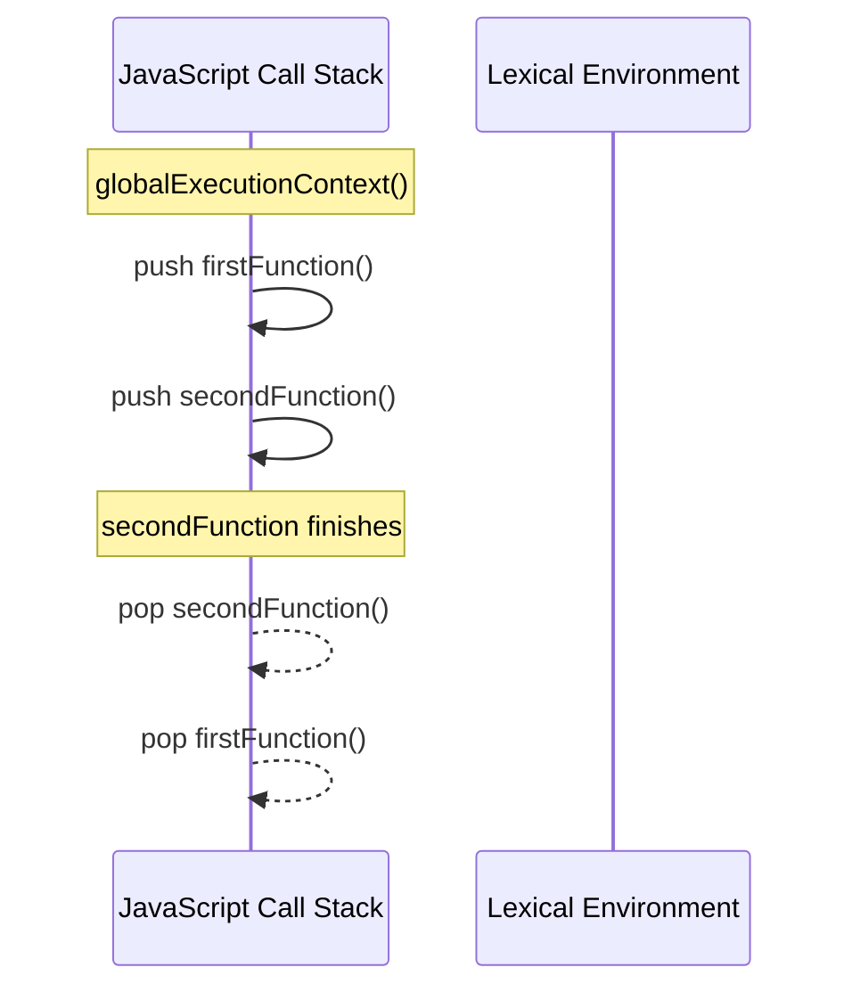

# 1.2 Functions, Closures & Context

[← Back to Chapter 1: JavaScript Fundamentals](./index.md)

Functions are first-class citizens in JavaScript. They can be stored in variables, passed as arguments, returned from other functions, and carry along lexical references to surrounding scopes via **Closures**.

---

## 1. Function Types & Variations

### A. Function Declaration
Hoisted completely with its function body, meaning it can be called before its definition in code.

```javascript
greet("Sarvy"); // "Hello, Sarvy!" (works due to hoisting)

function greet(name) {
  return `Hello, ${name}!`;
}
```

### B. Function Expression
Stored inside a variable. Hoisted according to the variable declaration rule (`var`, `let`, or `const`), so it cannot be invoked before the assignment.

```javascript
const multiply = function(a, b) {
  return a * b;
};
```

### C. Arrow Function (ES6)
Concise syntax with lexical `'this'` binding (arrow functions do not have their own `'this'`, `arguments`, or `prototype`).

```javascript
const add = (a, b) => a + b;

// Single parameter concise syntax
const square = x => x * x;
```

---

## 2. Execution Context & Call Stack

When JavaScript executes code, it evaluates it within an **Execution Context** consisting of two phases:

1. **Creation Phase (Memory Allocation)**:
   - Sets up the Global or Function Object.
   - Binds the `this` reference.
   - Allocates memory for variables (`undefined` for `var`, uninitialized for `let`/`const`) and function declarations.
2. **Execution Phase**:
   - Executes the code line-by-line, assigning values and invoking functions.



---

## 3. Lexical Scope (Static Scoping)

**Lexical Scope** means that the accessibility of variables is determined by their physical location within the written source code (at compile/parse time), not where functions are called at runtime (dynamic scoping).

- An inner function has access to variables defined in its own scope, its parent function's scope, and the global scope.
- Even if a function is passed around or invoked in a completely different part of the program, it still remembers the scope where it was originally **declared**.

```javascript
const globalGreeting = "Hello";

function parentScope() {
  const parentSecret = "React19";

  function childFunction() {
    // Looks outward into parentScope, then globalScope
    console.log(`${globalGreeting}, secret is ${parentSecret}`);
  }

  return childFunction;
}

const retrievedFn = parentScope();

// When executed here outside parentScope, it STILL retains access to parentSecret!
retrievedFn(); // "Hello, secret is React19"
```

This fundamental property of Lexical Scope directly forms the foundation of **Closures**.

---

## 4. What is a Closure?

> A **Closure** is the combination of a function bundled together with references to its surrounding state (the **lexical environment**). In JavaScript, closures give an inner function access to an outer function's scope even after the outer function has returned.

```javascript
function createCounter(initialValue = 0) {
  let count = initialValue; // Private variable captured in closure

  return {
    increment() {
      count++;
      return count;
    },
    decrement() {
      count--;
      return count;
    },
    getValue() {
      return count;
    }
  };
}

const counter = createCounter(10);
console.log(counter.increment()); // 11
console.log(counter.increment()); // 12
console.log(counter.getValue());  // 12
// Direct access to count is impossible:
// console.log(counter.count);    // undefined (encapsulated)
```

---

## 5. Practical Applications of Closures

### 1. Function Currying & Partial Application
Transforming a function with multiple arguments into a sequence of functions each taking one argument:

```javascript
const multiply = (a) => (b) => a * b;

const double = multiply(2);
const triple = multiply(3);

console.log(double(5)); // 10
console.log(triple(5)); // 15
```

### 2. Memoization (Caching Expensive Operations)

```javascript
function memoize(fn) {
  const cache = new Map();

  return function(...args) {
    const key = JSON.stringify(args);
    if (cache.has(key)) {
      return cache.get(key);
    }
    const result = fn(...args);
    cache.set(key, result);
    return result;
  };
}

const slowSquare = (n) => {
  // Simulating heavy computation
  return n * n;
};

const fastSquare = memoize(slowSquare);
fastSquare(4000); // Computed and stored
fastSquare(4000); // Returned instantly from closure cache
```

---

## 6. Closures in React & The "Stale Closure" Problem

React's Hooks architecture (`useState`, `useEffect`, `useCallback`) is powered by JavaScript closures. Each render has its own props, state, and event handlers.

### The Stale Closure Bug
A stale closure occurs when a function captures an older version of variables from a previous render and continues referencing that outdated snapshot.

```jsx
// ❌ Stale Closure Bug in useEffect
function Timer() {
  const [count, setCount] = useState(0);

  useEffect(() => {
    const timerId = setInterval(() => {
      // count here is frozen at 0 from the initial render!
      setCount(count + 1); 
    }, 1000);

    return () => clearInterval(timerId);
  }, []); // Empty dependency array captures initial scope only

  return <div>{count}</div>;
}
```

### The Solutions:
1. **Functional State Updates**:
```jsx
// ✅ Always operates on the most current state value
setCount((prevCount) => prevCount + 1);
```

2. **Accurate Dependency Arrays**:
```jsx
// ✅ Re-creates the effect whenever count changes
useEffect(() => {
  // ...
}, [count]);
```

3. **`useRef` for Mutable Latest Values**:
```jsx
const countRef = useRef(count);
countRef.current = count; // Always mirrors latest count without causing re-renders
```

---

## 7. Summary Checklist

- [x] Function declarations are hoisted with their body; function expressions and arrow functions are not.
- [x] Closures preserve access to outer variables even after the outer function finishes executing.
- [x] Use closures for data privacy, factories, and memoization.
- [x] Prevent stale closures in React by using functional state updates or properly listing dependencies.
