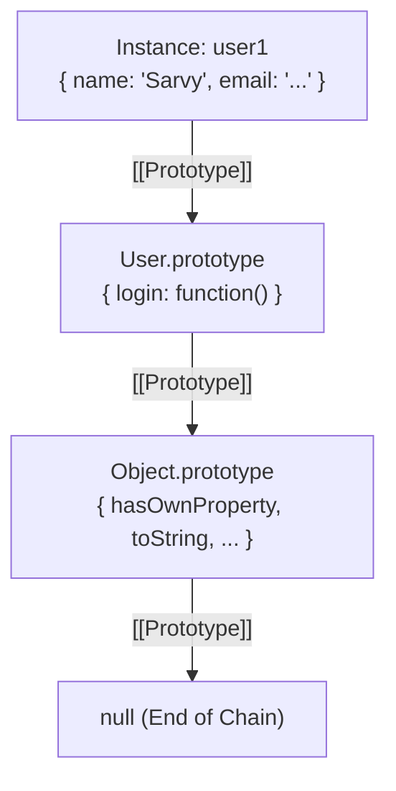

# 1.3 Objects, Prototypes & 'this'

[← Back to Chapter 1: JavaScript Fundamentals](./index.md)

JavaScript uses a prototype-based object model rather than classical class-based inheritance. Understanding prototypes, object memory allocation, and the runtime rules for `'this'` binding is essential for architecting robust JavaScript and React applications.

---

## 1. Object Creation Patterns

### A. Object Literals
The most straightforward and widely used pattern for creating single instances:

```javascript
const developer = {
  name: "Sarwvidya",
  role: "Full-Stack Engineer",
  code() {
    return `${this.name} is writing code...`;
  }
};
```

### B. Constructor Functions & `new`
Before ES6 classes, constructor functions were the primary mechanism for instantiating multiple objects sharing a prototype:

```javascript
function User(name, email) {
  this.name = name;
  this.email = email;
}

// Methods attached to the prototype save memory across all instances
User.prototype.login = function() {
  console.log(`${this.name} logged in.`);
};

const user1 = new User("Sarvy", "sarvy@example.com");
```

### C. ES6 Classes (Syntactic Sugar over Prototypes)

```javascript
class Person {
  constructor(name, age) {
    this.name = name;
    this.age = age;
  }

  introduce() {
    return `Hi, I am ${this.name}, age ${this.age}.`;
  }
}
```

---

## 2. Prototypal Inheritance & The Prototype Chain

Every JavaScript object has an internal link to another object called its **prototype** (`[[Prototype]]`, accessible via `Object.getPrototypeOf(obj)` or `__proto__`).

When accessing a property or method on an object:
1. The engine checks the object itself.
2. If not found, it traverses up the **Prototype Chain** to its prototype.
3. If still not found, it continues up until reaching `Object.prototype`.
4. If it reaches the end of the chain (`Object.prototype.__proto__ === null`), it evaluates to `undefined`.



```javascript
console.log(user1.hasOwnProperty('name')); // true (own property)
console.log(user1.hasOwnProperty('login')); // false (inherited from prototype)
console.log('login' in user1);              // true (found via prototype chain)
```

---

## 3. The 4 Rules of Dynamic `'this'` Binding

In JavaScript, `'this'` is determined by **how and where a function is called**, not where it is defined (with the exception of arrow functions).

### Rule 1: Default Binding (Standalone Function Call)
When called as a standalone function in non-strict mode, `this` refers to the global object (`window` in browsers). In `'use strict'`, it is `undefined`.

```javascript
function show() {
  console.log(this);
}

show(); // undefined (in strict mode) or Window
```

### Rule 2: Implicit Binding (Method Call on an Object)
When a function is called as a method of an object, `this` binds to the object preceding the dot `.`.

```javascript
const account = {
  balance: 5000,
  getBalance() {
    return this.balance;
  }
};

console.log(account.getBalance()); // 5000 (this -> account)

// Pitfall: Losing implicit binding when extracting the reference
const getBal = account.getBalance;
// console.log(getBal()); // undefined or error! (Default binding applied)
```

### Rule 3: Explicit Binding (`call`, `apply`, `bind`)
Directly specify what object `this` should point to:

- `call(thisArg, arg1, arg2, ...)`: Invokes function immediately with comma-separated arguments.
- `apply(thisArg, [arg1, arg2, ...])`: Invokes function immediately with an array of arguments.
- `bind(thisArg, arg1, arg2, ...)`: Returns a **new function** permanently bound to `thisArg`.

```javascript
function greet(greeting, punctuation) {
  return `${greeting}, ${this.name}${punctuation}`;
}

const profile = { name: "Sarwvidya" };

console.log(greet.call(profile, "Hello", "!"));       // "Hello, Sarwvidya!"
console.log(greet.apply(profile, ["Welcome", "!!"]));  // "Welcome, Sarwvidya!!"

const boundGreet = greet.bind(profile);
console.log(boundGreet("Hey", "?"));                  // "Hey, Sarwvidya?"
```

### Rule 4: `new` Binding (Constructor Calls)
When a function is called with the `new` keyword:
1. A brand new empty object `{}` is created.
2. Its `[[Prototype]]` is linked to the constructor's `prototype`.
3. The constructor runs with `this` bound to that new object.
4. The new object is automatically returned (unless the constructor explicitly returns another object).

---

## 4. Arrow Functions & Lexical `'this'`

Arrow functions **do not** bind their own `'this'`. Instead, they resolve `'this'` lexically from their enclosing execution context at definition time.

```javascript
const team = {
  title: "Engineering",
  members: ["Alice", "Bob"],
  printMembers() {
    // Arrow function captures 'this' from printMembers() (which is team)
    this.members.forEach(member => {
      console.log(`${member} works in ${this.title}`);
    });
  }
};

team.printMembers();
```

:::note React Event Handlers
In React class components, event callbacks lost their `'this'` context unless bound in the constructor (`this.handleClick = this.handleClick.bind(this)`) or declared as arrow function class fields (`handleClick = () => {}`). In modern functional components, hooks eliminate this entire class of bugs!
:::

---

## 5. Summary Checklist

- [x] Prototypes allow methods to be shared across all instances without replicating them in heap memory.
- [x] Lookups follow the prototype chain until reaching `Object.prototype` and eventually `null`.
- [x] Follow the 4 rules of `this`: Default, Implicit, Explicit (`call`/`apply`/`bind`), and `new`.
- [x] Arrow functions use lexical scope for `this`, making them ideal for callbacks and timers.
