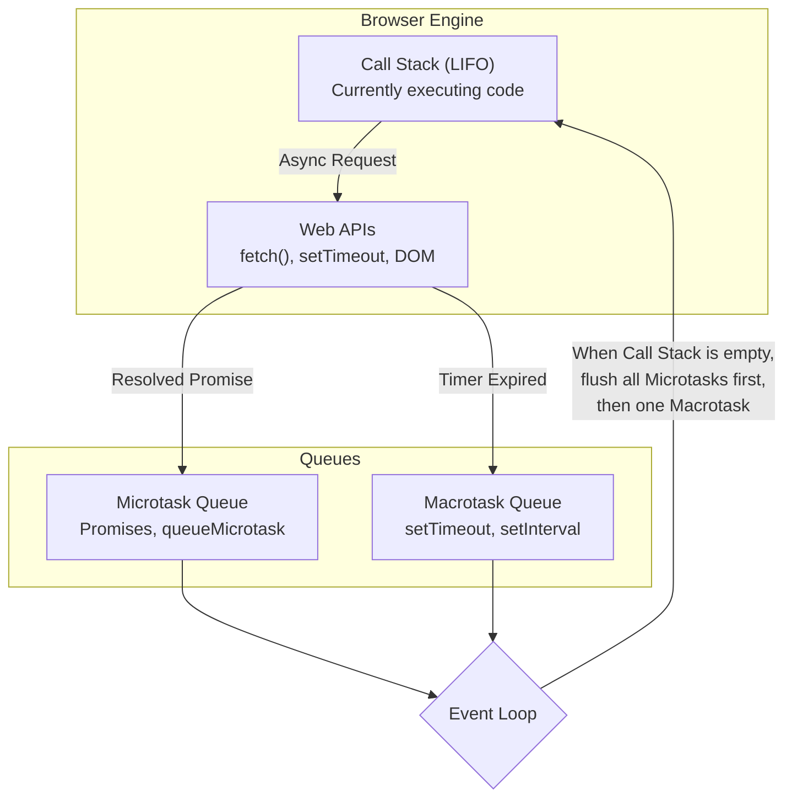

# 1.6 Async JS & Event Loop

[← Back to Chapter 1: JavaScript Fundamentals](./index.md)

JavaScript is a single-threaded language, meaning it can only execute one command at a time on its single call stack. Despite this, it handles non-blocking I/O, network requests, and animations with high performance thanks to the **Event Loop** and concurrency runtime.

---

## 1. JavaScript Concurrency Architecture

The JavaScript runtime consists of:
1. **Call Stack**: Executes synchronous code frames in a Last-In, First-Out (LIFO) order.
2. **Web APIs / Node APIs**: Multi-threaded host environment features (DOM events, `fetch()`, `setTimeout`, file I/O).
3. **Microtask Queue**: High-priority queue for Promise resolutions (`.then()`, `.catch()`, `async/await`), `queueMicrotask`, and `MutationObserver`.
4. **Macrotask Queue (Callback Queue)**: Standard-priority queue for `setTimeout`, `setInterval`, `setImmediate`, and UI rendering.



---

## 2. The Event Loop Cycle & Priority

The Event Loop continuously checks if the Call Stack is empty:
1. Executes any synchronous code on the **Call Stack** until empty.
2. Flushes **all pending tasks in the Microtask Queue** until it is completely drained (including microtasks queued by other microtasks).
3. Executes **one macrotask** from the Macrotask Queue.
4. Renders UI updates (if needed).
5. Repeats the loop.

```javascript
console.log("1. Synchronous Start");

setTimeout(() => {
  console.log("4. Macrotask (setTimeout)");
}, 0);

Promise.resolve().then(() => {
  console.log("3. Microtask (Promise)");
});

console.log("2. Synchronous End");

// Output Order:
// 1. Synchronous Start
// 2. Synchronous End
// 3. Microtask (Promise)
// 4. Macrotask (setTimeout)
```

---

## 3. Promises: Lifecycle & Combinators

A **Promise** represents an eventual completion (or failure) of an asynchronous operation and its resulting value.

### Promise States
- **Pending**: Initial state, neither fulfilled nor rejected.
- **Fulfilled**: The operation completed successfully (`resolve(value)`).
- **Rejected**: The operation failed (`reject(reason)`).

### Chaining & Error Handling
```javascript
function fetchUserData(userId) {
  return fetch(`https://api.example.com/users/${userId}`)
    .then(response => {
      if (!response.ok) throw new Error(`HTTP error! status: ${response.status}`);
      return response.json();
    })
    .catch(error => {
      console.error("Network or parsing failed:", error);
      throw error; // Re-throw to caller
    })
    .finally(() => {
      console.log("Fetch attempt completed.");
    });
}
```

### Promise Combinator Methods

| Method | Description | Fails Fast? |
| :--- | :--- | :--- |
| `Promise.all([p1, p2])` | Resolves when **all** succeed. Rejects immediately if **any** reject. | Yes |
| `Promise.allSettled([p1, p2])` | Waits for **all** to complete (whether resolved or rejected). | No |
| `Promise.race([p1, p2])` | Settles as soon as the **first** promise settles (resolves or rejects). | Yes (if 1st fails) |
| `Promise.any([p1, p2])` | Resolves as soon as the **first** promise succeeds; rejects only if all fail. | No |

```javascript
// Fetch multiple endpoints in parallel:
const [users, posts] = await Promise.all([
  fetch("/api/users").then(r => r.json()),
  fetch("/api/posts").then(r => r.json())
]);
```

---

## 4. `async` / `await` Syntax

`async` and `await` are syntactic sugar over Promises, making asynchronous code read sequentially like synchronous code.

- Any function marked `async` automatically returns a Promise.
- `await` pauses execution of the `async` function until the Promise settles, freeing the call stack to process other tasks.

```javascript
async function loadDashboard() {
  try {
    const user = await fetchUserData(101);
    const analytics = await fetchAnalytics(user.accountId);
    return { user, analytics };
  } catch (err) {
    console.error("Failed to load dashboard:", err);
    throw err;
  }
}
```

---

## 5. React Asynchronous Patterns & Race Conditions

When fetching data inside a React component's `useEffect`, fast user interactions (such as changing dropdown filters) can cause responses to return out of order—a **Race Condition**.

### Solution: Cancellation with `AbortController`

```jsx
import React, { useState, useEffect } from 'react';

function UserProfile({ userId }) {
  const [user, setUser] = useState(null);
  const [loading, setLoading] = useState(true);

  useEffect(() => {
    const controller = new AbortController();
    const { signal } = controller;

    async function loadData() {
      try {
        setLoading(true);
        const res = await fetch(`https://api.example.com/users/${userId}`, { signal });
        const data = await res.json();
        setUser(data);
      } catch (err) {
        if (err.name !== 'AbortError') {
          console.error("Fetch error:", err);
        }
      } finally {
        setLoading(false);
      }
    }

    loadData();

    // Cleanup: Abort pending request if userId changes or component unmounts
    return () => {
      controller.abort();
    };
  }, [userId]);

  if (loading) return <p>Loading user profile...</p>;
  return <div><h3>{user?.name}</h3></div>;
}
```

---

## 6. Summary Checklist

- [x] JavaScript is single-threaded; asynchronous concurrency is coordinated by the browser/Node event loop.
- [x] Microtasks (Promises) always take precedence over Macrotasks (`setTimeout`).
- [x] Use `async`/`await` with `try...catch` for readable, maintainable asynchronous workflows.
- [x] Guard against race conditions and memory leaks in React by utilizing `AbortController` in effect cleanups.
