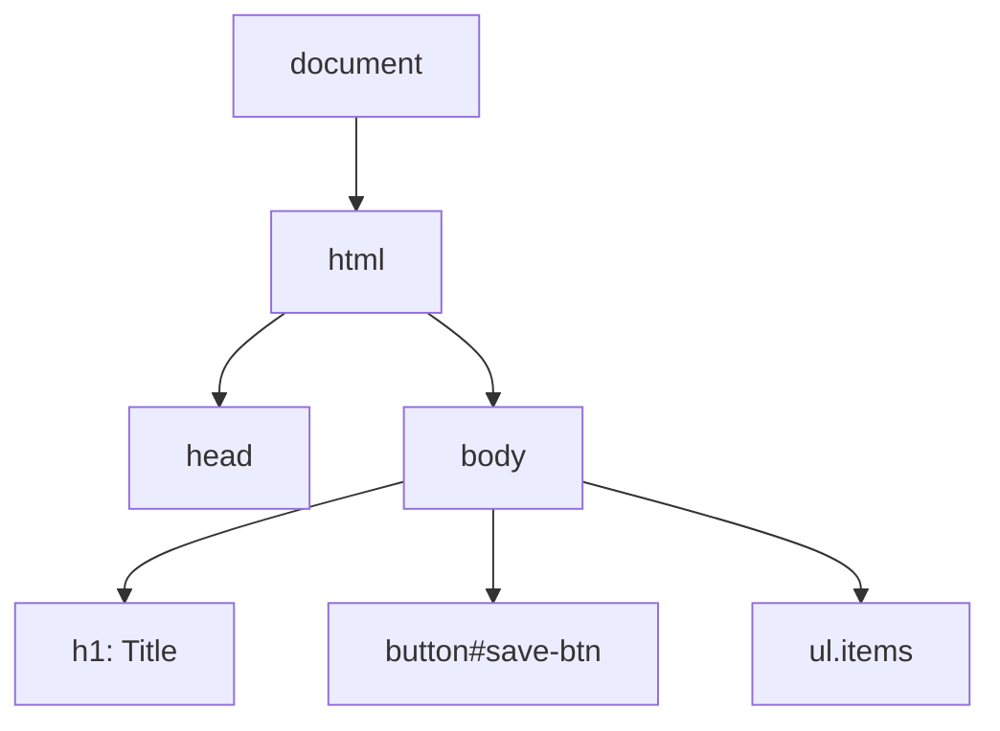
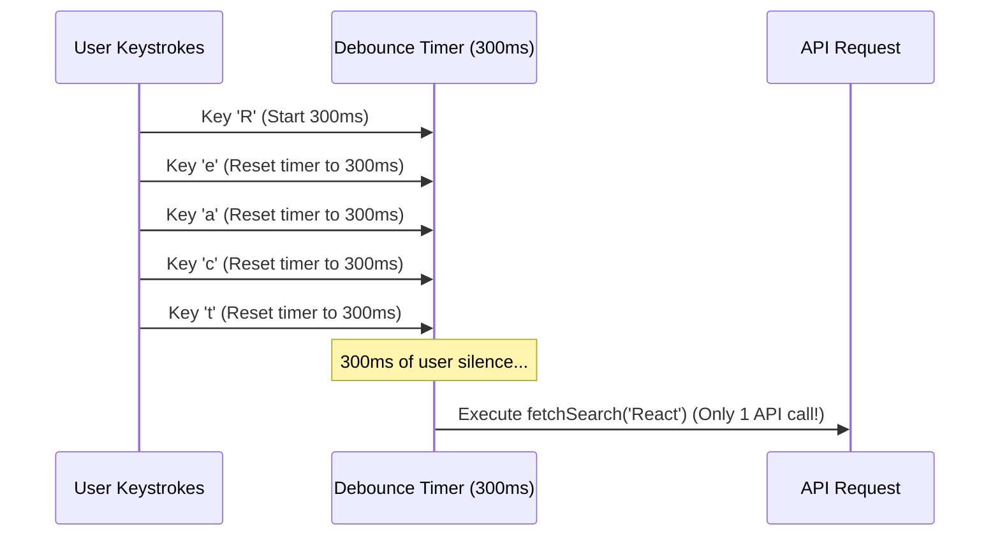

# 1.7 DOM Manipulation & Events

[← Back to Chapter 1: JavaScript Fundamentals](./index.md)

The **Document Object Model (DOM)** is an object-oriented representation of the web page that can be modified with JavaScript. Understanding DOM operations and event dispatch mechanics is crucial for understanding how modern libraries like React manage the Virtual DOM and synthesize events.

---

## 1. The DOM Tree & Querying Elements

The browser parses HTML into a tree structure of nodes (Elements, Text nodes, Comments).



### Modern DOM Query Methods
```javascript
// Querying by CSS selector (Recommended)
const header = document.querySelector('.main-header');
const allButtons = document.querySelectorAll('button.btn-primary'); // Returns NodeList

// Traditional queries
const submitBtn = document.getElementById('submit-btn');
const inputFields = document.getElementsByClassName('text-input'); // Returns live HTMLCollection
```

---

## 2. Event Propagation: Capturing, Target & Bubbling

When an event (like a click) occurs on an element, it does not just fire on that single element. It undergoes a 3-phase lifecycle:

1. **Capturing Phase (Trickling)**: The event descends down from `window` through ancestors towards the target element.
2. **Target Phase**: The event reaches the actual target element that was clicked.
3. **Bubbling Phase**: The event travels back up through ancestors to `window`.

```mermaid
graph TD
    subgraph 1. Capturing Phase (Top Down)
        W1[window] --> D1[document] --> B1[body] --> P1[div.container]
    end

    subgraph 2. Target Phase
        P1 --> T[button.target-element]
    end

    subgraph 3. Bubbling Phase (Bottom Up)
        T --> P2[div.container] --> B2[body] --> D2[document] --> W2[window]
    end
```

### Controlling Event Flow

- **`e.stopPropagation()`**: Stops the event from propagating further in the bubbling or capturing phases.
- **`e.stopImmediatePropagation()`**: Stops propagation AND prevents other event listeners attached to the *same element* from firing.
- **`e.preventDefault()`**: Prevents the browser's default action (e.g. following a link or submitting a form) without stopping event propagation.

```javascript
form.addEventListener('submit', (e) => {
  e.preventDefault(); // Prevents page reload on form submit
  console.log("Submitting form via Ajax/Fetch...");
});
```

---

## 3. Event Delegation Pattern

Instead of adding an event listener to dozens or hundreds of individual child elements (which consumes excessive memory), you attach a **single listener to a common parent** and inspect `event.target`.

```javascript
const list = document.querySelector('#todo-list');

list.addEventListener('click', (event) => {
  // Check if the clicked element has the delete button class
  if (event.target.classList.contains('delete-btn')) {
    const item = event.target.closest('li');
    item.remove();
  }
});
```

### Benefits of Event Delegation:
1. **Memory Efficiency**: 1 listener instead of $N$ listeners.
2. **Dynamic Elements**: Automatically works for newly added DOM nodes without reattaching listeners.

---

## 4. Browser Rendering: Reflow vs Repaint

Every time JavaScript touches the DOM, the browser may have to calculate layouts and redraw pixels:

- **Reflow (Layout)**: Recalculates geometries and positions of elements. Triggered by changing `width`, `height`, `margin`, `fontSize`, or reading layout metrics like `offsetWidth`, `scrollTop`, `getBoundingClientRect()`. **Very expensive!**
- **Repaint**: Redraws pixels on screen without altering layout (e.g. changing `color`, `background-color`, `visibility`). Faster than reflow, but still has a cost.

:::tip Optimization Tip
Batch DOM reads and writes. Reading layout immediately after writing causes **Forced Synchronous Layout** (layout thrashing).
:::

---

## 5. Performance Optimization: Debouncing & Throttling

When users type into a search box, scroll a long page, or resize the browser window, hundreds of events can fire per second. Executing heavy logic or API requests on every event causes severe performance lag (jank) and unnecessary server load.

### A. Debouncing (Wait for the Pause)
**Debouncing** delays the execution of a function until a specified period of inactivity (quiet period) has passed since the *last* invocation.



#### Pure JavaScript Implementation
```javascript
function debounce(func, delay = 300) {
  let timerId;

  return function(...args) {
    // Clear any pending timer from the previous keystroke
    clearTimeout(timerId);

    // Set a new timer
    timerId = setTimeout(() => {
      func.apply(this, args);
    }, delay);
  };
}

// Usage in DOM:
const searchInput = document.querySelector('#search');
const handleSearch = (e) => console.log("Searching for:", e.target.value);

searchInput.addEventListener('input', debounce(handleSearch, 400));
```

#### In React: Custom `useDebounce` Hook
```jsx
import { useState, useEffect } from 'react';

function useDebounce(value, delay = 300) {
  const [debouncedValue, setDebouncedValue] = useState(value);

  useEffect(() => {
    const handler = setTimeout(() => {
      setDebouncedValue(value);
    }, delay);

    // Cleanup: cancels previous timer if value changes within delay
    return () => clearTimeout(handler);
  }, [value, delay]);

  return debouncedValue;
}

// In Component:
function SearchComponent() {
  const [query, setQuery] = useState("");
  const debouncedQuery = useDebounce(query, 500);

  useEffect(() => {
    if (debouncedQuery) {
      fetchResults(debouncedQuery);
    }
  }, [debouncedQuery]);

  return <input value={query} onChange={e => setQuery(e.target.value)} />;
}
```

---

### B. Throttling (Enforce a Maximum Rate)
**Throttling** guarantees that a function executes at most **once every $N$ milliseconds**, regardless of how many times the event fires in between.

#### Pure JavaScript Implementation (Timestamp-based)
```javascript
function throttle(func, interval = 200) {
  let lastExecutionTime = 0;

  return function(...args) {
    const now = Date.now();

    if (now - lastExecutionTime >= interval) {
      lastExecutionTime = now;
      func.apply(this, args);
    }
  };
}

// Usage for window scroll / resize:
window.addEventListener('scroll', throttle(() => {
  const scrollPosition = window.scrollY;
  console.log("Current Scroll Position:", scrollPosition);
}, 200));
```

---

### C. Debounce vs Throttle Comparison

| Feature | Debounce | Throttle |
| :--- | :--- | :--- |
| **Execution Trigger** | After a period of inactivity (quiet window) | At regular, scheduled intervals |
| **Frequency** | Only 1 execution after burst stops | Fixed rate (e.g. max once every 250ms) |
| **Ideal For** | Search typeahead, form autosave, window resize recalculation | Infinite scrolling, mousemove tracking, drag-and-drop animations |
| **Mental Model** | "Wait until they stop talking" | "Release one car every 5 seconds" |

---

## 6. React Virtual DOM & Synthetic Events

Direct DOM manipulation is slow and error-prone. React solves this through two architectural layers:

### 1. Virtual DOM Reconciliation
React keeps a lightweight JavaScript representation of the DOM tree in memory. When state updates:
1. React creates a new Virtual DOM tree.
2. It diffs the new tree with the previous one (Reconciliation).
3. It computes the minimal set of real DOM mutations and applies them in a single optimized batch.

### 2. Synthetic Event System
React does not attach event listeners to individual DOM nodes under the hood. Instead, React uses **Event Delegation at the root level** (`#root` container) and wraps native browser events in a cross-browser `SyntheticEvent` wrapper with consistent behavior across Safari, Chrome, and Firefox.

```jsx
function ButtonGroup() {
  const handleClick = (e) => {
    // e is a React SyntheticEvent wrapping the native event (e.nativeEvent)
    console.log("Clicked:", e.target);
  };

  return <button onClick={handleClick}>Submit</button>;
}
```

---

## 7. Summary Checklist

- [x] Know the 3 phases of event flow: Capturing, Target, and Bubbling.
- [x] Use `event.preventDefault()` to stop default browser actions and `event.stopPropagation()` to stop bubbling.
- [x] Leverage Event Delegation to attach single listeners to parent containers for dynamic elements and performance.
- [x] Use **Debounce** when you want to wait for user input to pause (e.g. search suggestions, autosave).
- [x] Use **Throttle** when you want to enforce a maximum execution rate (e.g. scroll listeners, window resizing).
- [x] React abstracts direct DOM manipulation via the Virtual DOM and root-level Synthetic Events.
