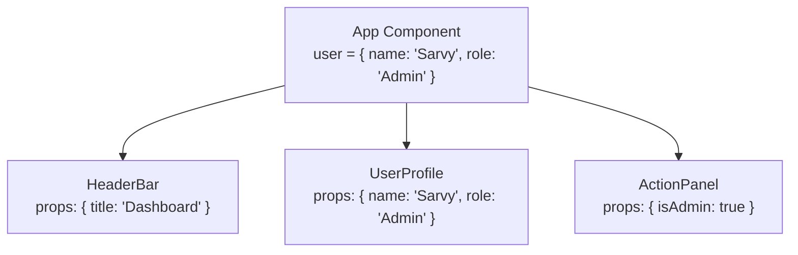

# 2.2 Components & Props

[← Back to Chapter 2: React Fundamentals](./index.md)

Components are the primary building blocks of React applications. They allow you to split the user interface into independent, reusable, and isolated pieces that accept inputs called **Props** and return JSX describing what should appear on the screen.

---

## 1. Functional Components

In modern React, components are written as plain JavaScript functions that start with a **Capital Letter**:

```jsx
// A valid React functional component
function WelcomeBadge() {
  return <div className="badge">Welcome to CodeWithSarvy!</div>;
}
```

:::warning Capitalization Rule
React treats components starting with lowercase letters (like `<button />`, `<div />`) as built-in DOM HTML tags. Components **must always start with an uppercase letter** (like `<WelcomeBadge />`).
:::

---

## 2. What are Props?

**Props** (short for *properties*) are the mechanism by which parent components pass data down to child components. Props follow **Unidirectional Data Flow** (top-down):



### Passing and Consuming Props
```jsx
// Parent component passing props
function App() {
  return (
    <main>
      <CourseCard 
        title="Mastering React 19" 
        lessonsCount={42} 
        isPublished={true}
        author={{ name: "Sarwvidya", verified: true }}
      />
    </main>
  );
}

// Child component destructuring props with fallbacks
function CourseCard({ title, lessonsCount = 0, isPublished, author }) {
  return (
    <article className="course-card">
      <h2>{title}</h2>
      <p>{lessonsCount} total lessons</p>
      <span>Author: {author.name} {author.verified && "✅"}</span>
    </article>
  );
}
```

---

## 3. `props.children`: The Power of Composition

When you nest JSX inside another component tag, React automatically bundles that inner content into a special prop named **`children`**:

```jsx
// Reusable Card container component
function Modal({ title, children }) {
  return (
    <div className="modal-backdrop">
      <div className="modal-content">
        <header className="modal-header">
          <h3>{title}</h3>
        </header>
        <section className="modal-body">
          {children}
        </section>
      </div>
    </div>
  );
}

// Usage: passing arbitrary JSX into children
function DeleteConfirmation() {
  return (
    <Modal title="Delete Repository">
      <p>Are you sure you want to delete this repository? This cannot be undone.</p>
      <div className="btn-group">
        <button className="btn-danger">Confirm Delete</button>
        <button className="btn-secondary">Cancel</button>
      </div>
    </Modal>
  );
}
```

:::tip Composition Over Inheritance
React recommends **composition over inheritance** to reuse code between components. Never create component class inheritance hierarchies. Use `children` and specialized props to pass components into other components.
:::

---

## 4. Props are Read-Only (Pure Functions)

React requires that all components act as **Pure Functions** with respect to their props:

> **Rule of Pure Functions**: A function must not mutate its input arguments, and given the same inputs, it must always return the same output.

```jsx
// ❌ WRONG: Never mutate props directly!
function BadComponent(props) {
  props.title = "New Title"; // TypeError in strict mode or causes state corruption!
  return <h1>{props.title}</h1>;
}

// ✅ CORRECT: If data needs to change over time, use State!
```

---

## 5. Summary Checklist

- [x] Components are reusable functions that accept props and return JSX; must begin with a capital letter.
- [x] Props flow strictly in a top-down, unidirectional direction from parent to child.
- [x] Destructure props in component parameters with default values for clean, self-documenting code.
- [x] Leverage `props.children` to build flexible, composable container layouts.
- [x] Props are strictly immutable (read-only); never mutate props directly.
