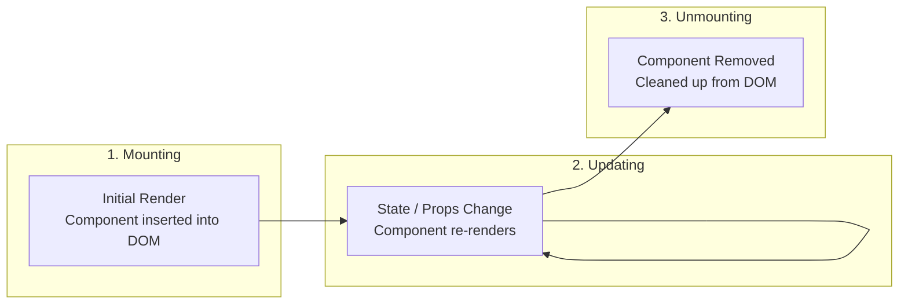

# 2.8 Component Lifecycle & useEffect

[← Back to Chapter 2: React Fundamentals](./index.md)

React components experience a natural lifecycle: they appear on screen (**Mounting**), re-render with new props or state (**Updating**), and disappear when no longer needed (**Unmounting**). The **`useEffect`** hook lets you synchronize external systems and manage side-effects across these lifecycle phases.

---

## 1. The Three Lifecycle Phases



---

## 2. What is a Side-Effect?

A **side-effect** is any operation that affects something outside the scope of the function being executed:
- Fetching data from an external API
- Setting up a subscription or WebSocket
- Setting timers (`setTimeout`, `setInterval`)
- Manually mutating the browser DOM (e.g. `document.title = ...`)
- Listening to global window events (`scroll`, `resize`)

In React, the main render body should be pure. All side-effects must be placed inside `useEffect`.

---

## 3. The Anatomy of `useEffect`

```jsx
import { useEffect } from 'react';

useEffect(() => {
  // 1. Effect logic (runs after render)

  return () => {
    // 2. Optional cleanup function (runs before next effect and on unmount)
  };
}, [/* 3. Dependency Array */]);
```

### The 3 Rules of the Dependency Array:

| Syntax | When it Runs | Common Use Case |
| :--- | :--- | :--- |
| **`useEffect(fn)`** *(No array)* | Runs after **every single render** | Rarely used (logging, measuring DOM) |
| **`useEffect(fn, [])`** *(Empty array)* | Runs **once** on initial mount | Initial data fetch, global event listener |
| **`useEffect(fn, [prop, state])`** | Runs on mount + whenever dependencies change | Re-fetching data when an ID or filter changes |

```jsx
// Runs only when userId changes
useEffect(() => {
  async function fetchUser() {
    const res = await fetch(`/api/users/${userId}`);
    const data = await res.json();
    setUser(data);
  }

  fetchUser();
}, [userId]);
```

---

## 4. The Cleanup Function

If your effect sets up a continuous process (timers, subscriptions, event listeners), it **must return a cleanup function** to prevent memory leaks:

```jsx
import { useState, useEffect } from 'react';

function WindowWidthMonitor() {
  const [width, setWidth] = useState(window.innerWidth);

  useEffect(() => {
    function handleResize() {
      setWidth(window.innerWidth);
    }

    // 1. Attach listener on mount
    window.addEventListener('resize', handleResize);

    // 2. Cleanup: Remove listener when component unmounts!
    return () => {
      window.removeEventListener('resize', handleResize);
    };
  }, []); // Empty array = mount & unmount only

  return <p>Window width: {width}px</p>;
}
```

### Why Cleanup Matters in React 18 & 19
In Development Mode under `<React.StrictMode>`, React mounts components, immediately unmounts them, and re-mounts them again. If your cleanup function is missing or incomplete, timers and subscriptions will duplicate!

---

## 5. Summary Checklist

- [x] Components have 3 lifecycle phases: Mounting, Updating, and Unmounting.
- [x] Place all side-effects (data fetching, subscriptions, DOM mutations) inside `useEffect`.
- [x] Omit the dependency array to run on every render; provide `[]` to run once on mount; provide `[dep]` to re-run on specific changes.
- [x] Always return a cleanup function from effects that register event listeners, intervals, or abortable network requests.
